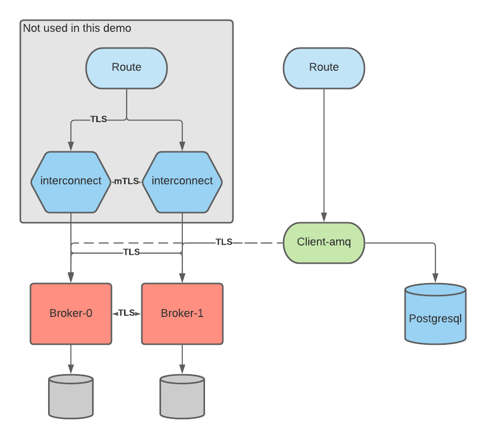

# Quarkus Messaging-db-streaming example

This is an example of porting a medium complexity spring boot application to quarkus.
The original application can be found here:

## Environment preparation

This script will create the following architecture:



### AMQ

All systems are in HA.

All connection are TLS and certificate provisioning and renewal is fully automated.

Three clients options are available.

#### Prerequisites

Install a recent version of cert-manager

```shell
oc new-project cert-manager
oc apply --validate=false -f https://github.com/jetstack/cert-manager/releases/download/v1.0.4/cert-manager.yaml
```

#### Install AMQ Operator

```shell
export project=amq
oc new-project ${project}
envsubst < ./environment-set-up/amq/operator.yaml | oc apply -f - -n ${project}
```

#### Helper Operators (optional)

```shell
oc apply -f https://raw.githubusercontent.com/redhat-cop/resource-locker-operator/master/deploy/olm-deploy/subscription.yaml -n ${project}
helm repo add stakater https://stakater.github.io/stakater-charts
helm repo update
export uid=$(oc get project ${project} -o jsonpath='{.metadata.annotations.openshift\.io/sa\.scc\.uid-range}'|sed 's/\/.*//')
helm upgrade -i -n ${project} reloader stakater/reloader --set reloader.deployment.securityContext.runAsUser=${uid}
```

Resource locker operator automates the injection of the injection of keystore and truststore in the secrets.

Reloader automates the reboot of pods when certificates are renewed.

#### Install AMQ Broker

##### Prepare certificates

```shell
export base_domain=$(oc get dns cluster -o jsonpath='{.spec.baseDomain}')
envsubst < ./environment-set-up/amq/certs.yaml | oc apply -f - -n ${project}

# if you installed resource-locker-operator run this
oc adm policy add-role-to-user edit -z default -n ${project}
envsubst < ./environment-set-up/amq/cert-patches.yaml | oc apply -f - -n ${project}


# if you didn't install resource-locker-operator run this (and re-run it every time certificates are renewed)
oc extract secret/amq-amqp-tls-secret --keys=keystore.jks --to - -n ${project}> /tmp/broker.ks
oc extract secret/amq-amqp-tls-secret --keys=truststore.jks --to - -n ${project} > /tmp/client.ts
oc set data secret/amq-amqp-tls-secret --from-file=/tmp/broker.ks --from-file=/tmp/client.ts -n ${project}
oc extract secret/amq-console-secret --keys=keystore.jks --to - -n ${project} > /tmp/broker.ks
oc extract secret/amq-console-secret --keys=truststore.jks --to - -n ${project} > /tmp/client.ts
oc set data secret/amq-console-secret --from-file=/tmp/broker.ks --from-file=/tmp/client.ts -n ${project}
```

##### Install AMQ Broker manifests

```shell
oc apply -f ./environment-set-up/amq/amq.yaml -n ${project}
```

##### Certificate renewal

```shell
# if you installed skater/reloader, you have already created the patch configuration above together with the certs

# if you didn't install skater/reloader, run this every time the certificates are renewed
oc rollout restart statefulset amq-ss -n ${project}
```

#### Interconnect

Interconnect provides the ability to create broker topology-unaware clients and sets you up for multi-cluster deployment of the brokers.

##### Deploy interconnect operator

```shell
oc apply -f ./environment-set-up/amq/interconnect-operator.yaml -n ${project}
```

##### Deploy certificates

```shell
export base_domain=$(oc get dns cluster -o jsonpath='{.spec.baseDomain}')
envsubst < ./environment-set-up/amq/interconnect-certs.yaml | oc apply -f - -n ${project}
```

patching the certs

```shell
# If you installed resource locker operator run the following:
envsubst < ./environment-set-up/amq/interconnect-cert-patches.yaml | oc apply -f - -n ${project}

# If you didn't install resource locker, run the following (and every time the certificates are renewed)
oc extract secret/amq-amqp-tls-secret --keys=ca.crt --to - -n ${project} > /tmp/tls.crt
oc set data secret/amq-amqp-mesh-client-tls-secret --from-file=/tmp/tls.crt -n ${project}
```

##### Deploy router-mesh

```shell
oc apply -f ./environment-set-up/amq/interconnect.yaml -n ${project}
```

##### Interconnect certificate renewal

```shell
# if you installed skater/reloader, you have already created the patch configuration above together with the certs

# if you didn't install skater/reloader, run this every time the certificates are renewed
oc rollout restart deployment router-mesh -n ${project}
```

## Postgresql

```shell
oc process postgresql-ephemeral -n openshift POSTGRESQL_PASSWORD=postgresql POSTGRESQL_USER=postgresql | oc apply -f - -n ${project}
```

## Deploy original spring-boot application

```shell
oc import-image ubi8/openjdk-11 --from=registry.access.redhat.com/ubi8/openjdk-11 --confirm -n ${project}
oc new-app openjdk-11~https://github.com/raffaelespazzoli/amq-test --name springboot-amq -n ${project} -l app=springboot-amq
oc apply -f ./environment-set-up/spring-boot/application-properties.yaml -n ${project}
oc set volume deployment/springboot-amq --add --configmap-name=application-properties --mount-path=/config --name=config -t configmap -n ${project}
oc set volume deployment/springboot-amq --add --secret-name=amq-amqp-tls-secret --mount-path=/certs --name=certs -t secret -n ${project}
oc set env deployment/springboot-amq SPRING_CONFIG_LOCATION=/config/application-properties.yaml SPRING_PROFILES_ACTIVE=server -n ${project}
oc expose service springboot-amq --port 8080-tcp -n ${project}
```

## Work with the quarkus app locally (dev profile)

```shell
docker run -it --rm -p 8161:8161 -p 61616:61616 -p 5672:5672 -e ARTEMIS_USERNAME=quarkus -e ARTEMIS_PASSWORD=quarkus vromero/activemq-artemis:2.11.0-alpine
mvn clean quarkus:dev
```

## Work with the quarkus app remotely (rdev profile)

```shell
odo push -f
odo watch
```

## Deploy the java-quarkus application (production profile)

```shell
./mvnw clean package -Dquarkus.container-image.build=true -Dquarkus.container-image.push=true
#oc apply -f ./environment-set-up/quarkus/application-properties.yaml -n ${project}
oc create configmap application-properties-quarkus --from-file=src/main/resources/application.properties --dry-run -o yaml -n ${project} | oc apply -f - -n ${project}
oc apply -f ./target/kubernetes/kubernetes.yml -n ${project}
oc expose service quarkus-amq --port http -n ${project}
```

## Deploy the native-quarkus application (production profile)

```shell
./mvnw package -Pnative -Dquarkus.native.container-runtime=podman -Dquarkus.native.container-build=true -Dquarkus.container-image.build=true -Dquarkus.container-image.push=true -Dquarkus.profile=native
#oc apply -f ./environment-set-up/quarkus/application-properties.yaml -n ${project}
oc create configmap application-properties-quarkus --from-file=src/main/resources/application.properties --dry-run -o yaml -n ${project} | oc apply -f - -n ${project}
oc apply -f ./target/kubernetes/kubernetes.yml -n ${project}
oc expose service quarkus-amq-native --port http -n ${project}
```

## Performance result

Here are some stats:

|            | boot time | memory consumption at rest | cpu consumption at rest |
|----------|:-------------:|:------:|:------:|
| spring boot | 8.5s     | 440MiB    | 1.5mc |
| quarkus jvm | 1.1s     | 320MiB    | 0.5mc |
| quarkus native | 100ms | 120MiB | 0.1mc |

## Original Quarkus Instructions

### quarkus-messaging-db-stream-example project

This project uses Quarkus, the Supersonic Subatomic Java Framework.

If you want to learn more about Quarkus, please visit its website: https://quarkus.io/ .

#### Running the application in dev mode

You can run your application in dev mode that enables live coding using:

```shell script
./mvnw compile quarkus:dev
```

#### Packaging and running the application

The application can be packaged using:

```shell script
./mvnw package
```

It produces the `quarkus-messaging-db-stream-example-1.0.0-SNAPSHOT-runner.jar` file in the `/target` directory.
Be aware that it’s not an _über-jar_ as the dependencies are copied into the `target/lib` directory.

If you want to build an _über-jar_, execute the following command:

```shell script
./mvnw package -Dquarkus.package.type=uber-jar
```

The application is now runnable using `java -jar target/quarkus-messaging-db-stream-example-1.0.0-SNAPSHOT-runner.jar`.

#### Creating a native executable

You can create a native executable using:

```shell script
./mvnw package -Pnative
```

Or, if you don't have GraalVM installed, you can run the native executable build in a container using:

```shell script
./mvnw package -Pnative -Dquarkus.native.container-build=true
```

You can then execute your native executable with: `./target/quarkus-messaging-db-stream-example-1.0.0-SNAPSHOT-runner`

If you want to learn more about building native executables, please consult https://quarkus.io/guides/maven-tooling.html.
